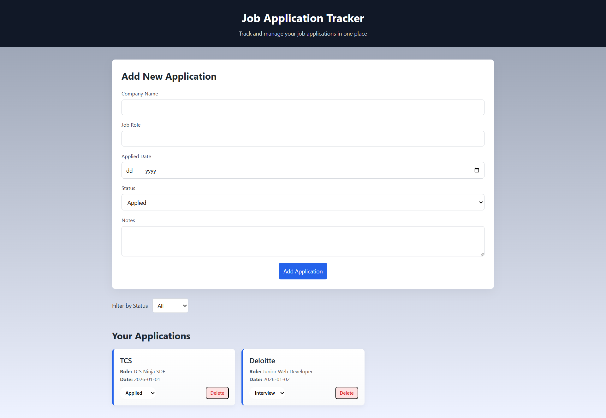
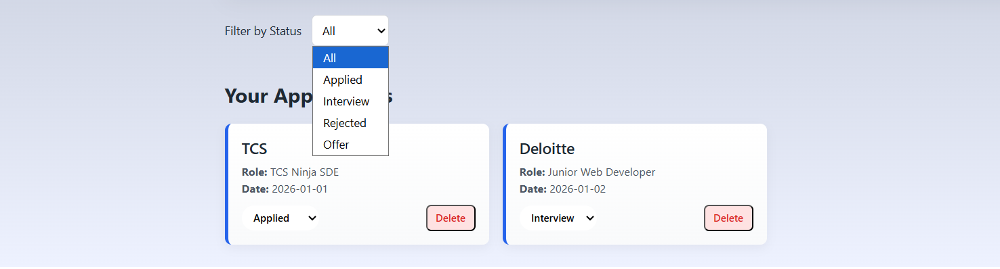

# Job Application Tracker

A simple and intuitive web application to track and manage job applications in one place.  
Built using vanilla JavaScript with a focus on clean UI, state management, and real world functionality.

## Live Demo
👉 https://tourmaline-tulumba-e34fd9.netlify.app/

## Features
- Add and manage job applications with company name, role, date, status, and notes
- Update application status directly from the application card
- Filter applications by status (Applied, Interview, Rejected, Offer)
- Delete applications when no longer needed
- Persistent data storage using browser localStorage
- Responsive and clean user interface

## Tech Stack
- HTML5
- CSS3
- JavaScript (ES6)
- Netlify for deployment

## What I Learned
- DOM manipulation and dynamic rendering
- Managing application state using arrays of objects
- Event delegation for efficient event handling
- Persisting data using localStorage
- Structuring a frontend project cleanly
- Deploying a static web application using Netlify

## Screenshots

### Home Page

### Applications card

##My Future Improvements plans
- Edit application details
- Search functionality
- Sort applications by date or company
- Convert to full stack application using React and backend API

## Author
**Basu Patra**  
Aspiring Web Developer
